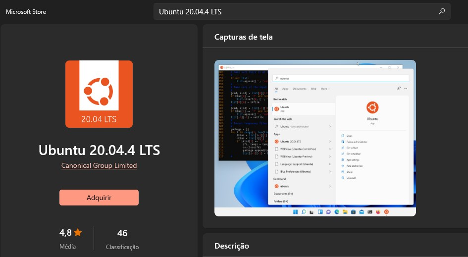
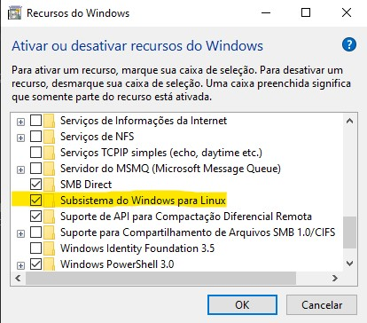
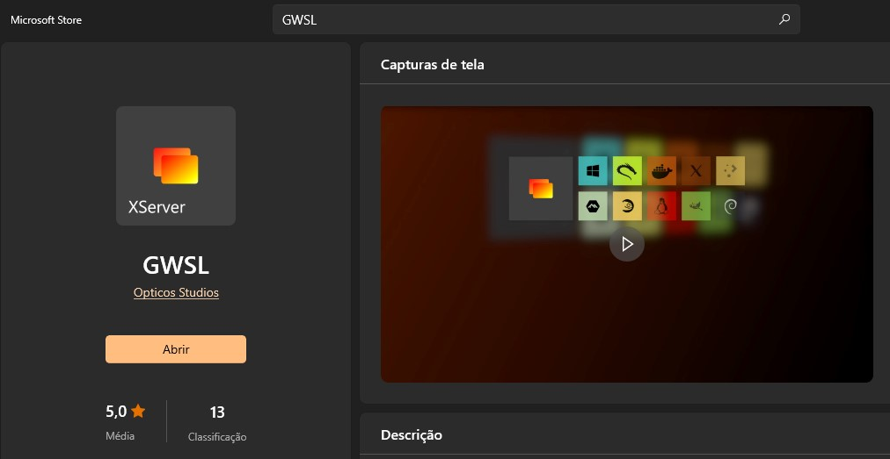
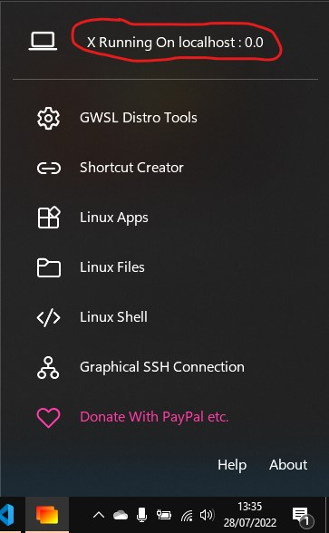

# Preparando um Ambiente Linux
Nesse tutorial vamos aprender a instalar e configurar o WSL - Windows Subsystem Linux, que é um terminal do linux para utilizar no Sistema Operacional do Windows sem a necessidade de uma criar uma VM.

## Instalação

1 - Na barra de pesquisa digite "Microsoft Store" e abra o aplicativo. No Microsoft Store pesquise por:  
```bash
"Ubuntu 20.04.4 LTS"   
```



2 - Instale o WSL e configure os Recursos do Windows, para fazer isso aberte a tecla Windows+R e digite:
```bash
"optionalFeatures"
```



Marque a opção:
```bash
"Subsistema do Windows para Linux"
```
3 - Assim que instalado o wsl abrirá uma tela para configurar seu nome de usuário e senha. Para mais detalhes o link abaixo que mostra como configurar um ambiente de desenvolvimento WSL.  
- https://docs.microsoft.com/pt-br/windows/wsl/setup/environment#set-up-your-linux-username-and-password


4 - Ainda no Microsoft Store pesquise por:
```bash
"GWSL"
```


Instale o GWSL que se trata de um XServer que auxilia a executar aplicativos linux com tela gráfica. Precisamos de um XServer, pois o WSL não suporte para rodar aplicações gráficas.


5 - Passe para o tutorial de Instalação do git:

- [Tutorial de Instalação do Git](/tutoriais/gerador-asda/INSTALARGIT.md).


6 - Após instalar o git e clonar o repósitorio, antes de rodar o projeto execute o GWSL:



7 - Defina na pasta do seu repositório a variável de ambiente $DISPLAY para acessar o GWSL:

```bash
export DISPLAY=:0.0 
```

## References ##
- https://docs.microsoft.com/pt-br/windows/wsl/install

